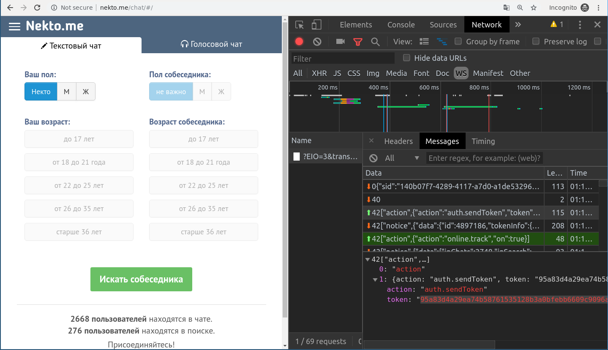

# Connection wrapper for nektome anonymous chat.

Connection wrapper written in golang. This project contains one file bot/bot.go which provides all functionality. To set up the bot you need to:
* Get the token (you can connect to nektome without token, but you have to solve the captcha).
* Set all handlers for messages (originally bot has few handlers to host simeple chat-client).
* Create main loop (main.go has an example of simple client).

# How to get "trusted" token 

To get the trusted token you need to solve the captcha by yourself. First open developer tools in your browser and go to the address http://nekto.me/chat/#/
Open netowork tab and set filter to websockets. There is only one websocket connection, open this and go to messages tab. Pick third message and copy the token.

After that start search interlocutor, click the green button. Solve the captcha. After solving you got the trunsted token.

# JSON messages docs

The structures and discriptions of nektome JSON messages you can find at http://im.nekto.me/docs/
