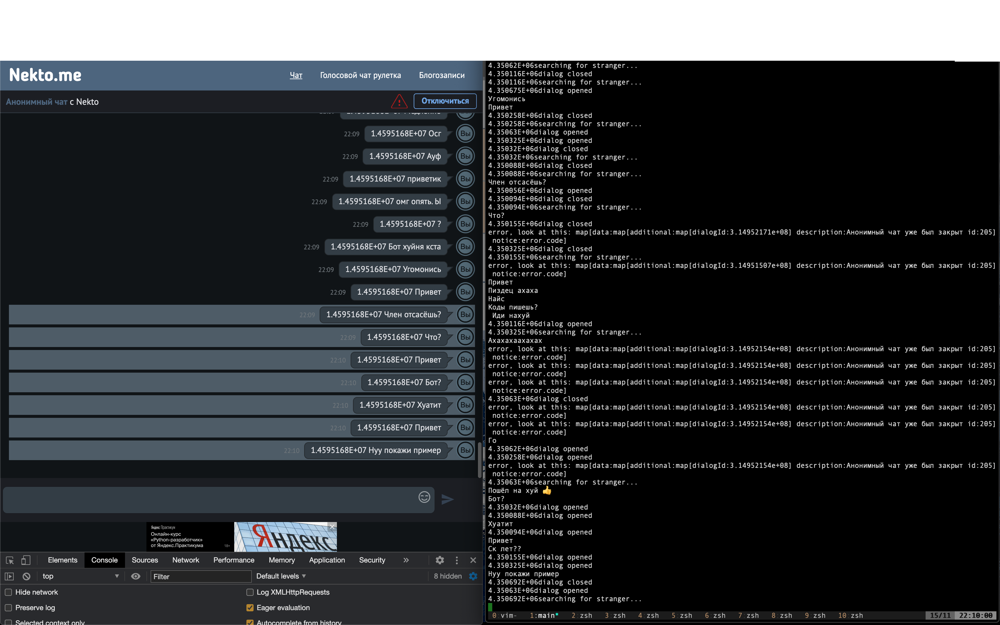

# Shared chat in nekto.me/chat/

Written with github.com/carsenolson/nektomebot;
Generates as many bots as in tokens/tokens tokens, then they start search interlocutor and start send interlocutor's message to eachother.



## Installation

```
git clone "https://github.com/carsenolson/nektomebot.git"
go build -o main main.go
./main
```

## TODO 

Collect as many "trusted" tokens as I can 👨🏿‍💻
